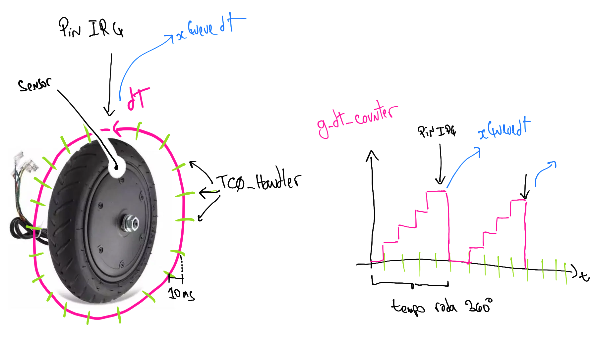
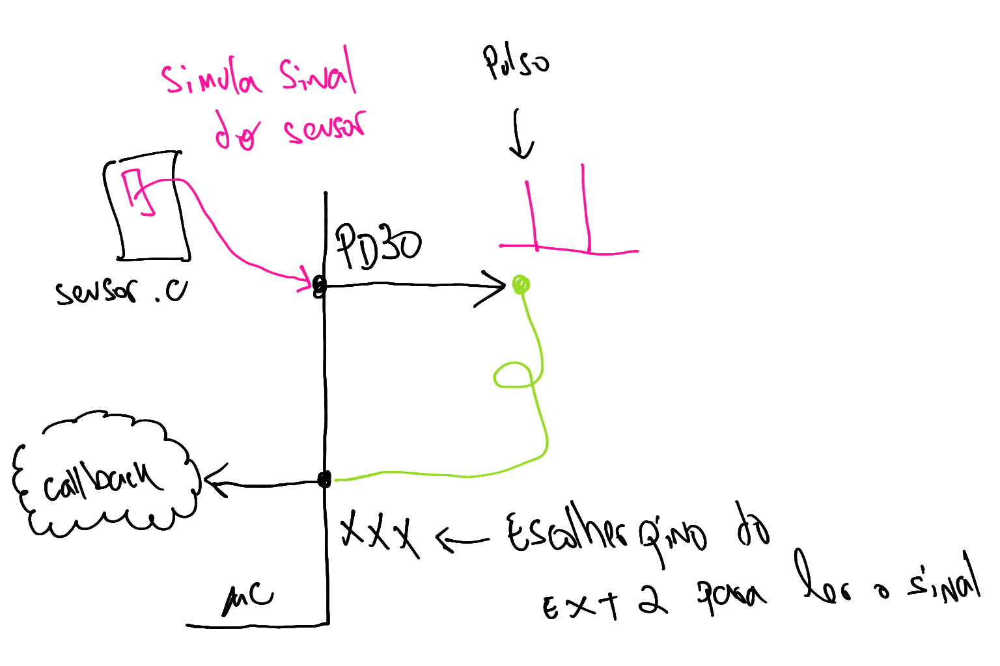

# 21a - emb - AV3

- **A cada 30 minutos você deverá fazer um commit no seu código!**
    - Códigos que não tiverem commit a cada 30min ou que mudarem drasticamente entre os commits serão descartados (conceito I) !!
    - Você deve inserir mensagens condizentes nos commits!
- Duração: 3h
- Faça o seu trabalho de maneira ética!

Usem como base o código disponível neste repositório.

## Descrição

Vamos criar um protótipo de um controlador de um patinete elétrico! 


Para isso iremos usar o OLED1 da seguinte maneira:

- Botão 1: Aumenta potência do patinete
- Botão 3: Diminui potência do patinete
- OLED exibe:
    - velocidade
- LEDs exibem:
    - potência atual

### Começando

Conexões:

- Conecte o pino do EXT2 PD30 no também do EXT2 PA21 
- Conecte o OLED1 no EXT1

Código base:

- Três botões do OLED configurados com IRQ e Callback
- Três LEDs do OLED configurados como saída
- OLED inicializado 
- `task_main`: Onde será realizado todo o controle do patinete.
- `sensor.c`: Código que simula pulso da roda no pino PD30.

**TODO PROCESSAMENTO OU EXIBIÇÃO DE INFORMAÇÕES (LEDS/ OLED) DEVE SER REALIZADA NA TASK MAIN.**

### Funcionamento

Você deve entregar um protótipo que calcula e exibe a velocidade do patinete no OLED e exibe a potência do motor nos três LEDs da placa.

#### Potência

A potência deve ser processada na `task_main` sendo utilizados semáforos ou fila para a comunicação entre o callback dos botões e a tarefa `main`. O controle da potência será feito pelos botões da placa OLED (`btn1` e `btn3`) e exibida nos LEDs da placa OLED. 

A principio podemos ter 4 níveis de potência:

- `0`: Nenhum LED aceso
- `1`: Apenas um LED aceso 
- `2`: Dois LEDs acesos
- `3`: Todos LEDs acesos

**É PARA USAR SEMÁFOROS OU FILA, NÃO COMUNICAR CALLBACK VIA FLAGS**

Para ajustar a potência do patinete, você deve chamar a função `patinete_power()` passando como valor a potência atual do patinete (`0`, `1`, `2`, `3`).

Resumo:

- [ ] Criar fila/ semáfaros para comunicação callback botões -> `task_main`
- [ ] Enviar informação para a task main via o recurso criado anteriormente
- [ ] Ler informação na `task_main` e implementar a lógica da potência
    - Dica: Criar uma função para exibir nos LEDs a potência.
- [ ] Chamar a função `patinete_power( )` passando o valor da potência atual do patinete (`[0,1,2,3]`).

#### Velocidade



O cálculo da velocidade do patinete será feita via a leitura do tempo entre um pulso e outro que representa o tempo de rotação de uma volta completa da roda (sensor magnético). O código fornecido de exemplo gera um pulso simulado no pino PD30 (EXT2) que simula o sinal do sensor.

Iremos utilizar o TimerCounter para calcular o tempo entre um pulso e outro da roda. O TC deve ser configurado para operar em 100Hz (10ms). No TC iremos incrementar uma variável global (`g_tc_counter`) que indicará quanto tempo (pulsos) durou um rotação.

Você deve configurar o pino do EXT2 PA21 para operar como leitura digital do sinal do sensor (com interrupção em borda de subida).



Toda vez que ocorrer um pulso no pino você deve:

1. Ler o valor atual da var `g_tc_counter`
1. Enviar o valor pela fila `xQueuedT`
1. Zerar a variável `g_tc_counter`

Na `task_main` você deve receber o dado (`dT`) da fila `xQueuedT` e calcular a velocidade do patinete. A velocidade (v) é decorrente da velocidade angular (w) de sua roda, sendo calculado por: `v = w*r*3.6 [km/h]`.

O cálculo de `w` é realizado por:

`w`: `w = 2*pi/T [rad/s]`

Onde `T = dT * 0.01s`

Vamos supor que a roda do patinete tem `0.2m` de raio.

``` 
Exemplo: 

1. dT = 45             (pulsos)
2. T = dT*0.01 = 0.42  [s]
3. w = 2*pi/T  = 14.96 [rad/s]
4. v = r*w*3.6 = 10.12 [km/h]
```

Resumo:

- [ ] Configure o TC para operar a 100Hz; crie uma variável global: `g_tc_counter` e incremente a variável `g_tc_counter` a cada interrupção do TC.
    - **Usar o TC0 canal 0.**
- [ ] Crie uma fila de inteiros `xQueuedT`
- [ ] Configure o pino PA21 como entrada digital e com interrupção de borda de subida (não esqueça da função de callback). A cada interrupção, coloque o valor da variável `g_tc_counter` na fila `xQueuedT` e então zere a variável `g_tc_counter`.
- [ ] Na `task_main` receba o dado na fila `xQueuedT` calcule e exiba a velocidade.

### C (mínimo)

> Ao terminar preencher o forms: https://forms.gle/3TmQXdC2aQXr8DSv7

Atenção! Você precisa do C para ganhar os pontos extras, não vale fazer os extras para compensar alguma coisa não realizado do C - mínimo!

- [ ] **Segue a estrutura de firmware especificada (semáforos e filas)**
- [ ] Exibe a velocidade no LCD
- [ ] Exibe a potência nos LEDs
- [ ] Possibilita ajustar potência

### extras 

- (+1.0) Exibe distância percorrida (acumular quantas voltas a roda já deu e)
- (+1.0) Usa RTT no lugar de TC para calular o dT
- (+1.0) Possibilita desligar/ligar patinete segurando o btn2 por 10 segundos (limpa LCD);
- (+0.5) Mais uma potência (n4): Todos os LEDs piscando
- (+0.5) Exibe a potência no OLED (exemplo: `|****|`, `|**  |`)
- (+0.5) Exibe velocidade 0 quando fica um tempo sem receber pulsos (dt)
- (+0.5) Calcula e exibe velocidade média.
